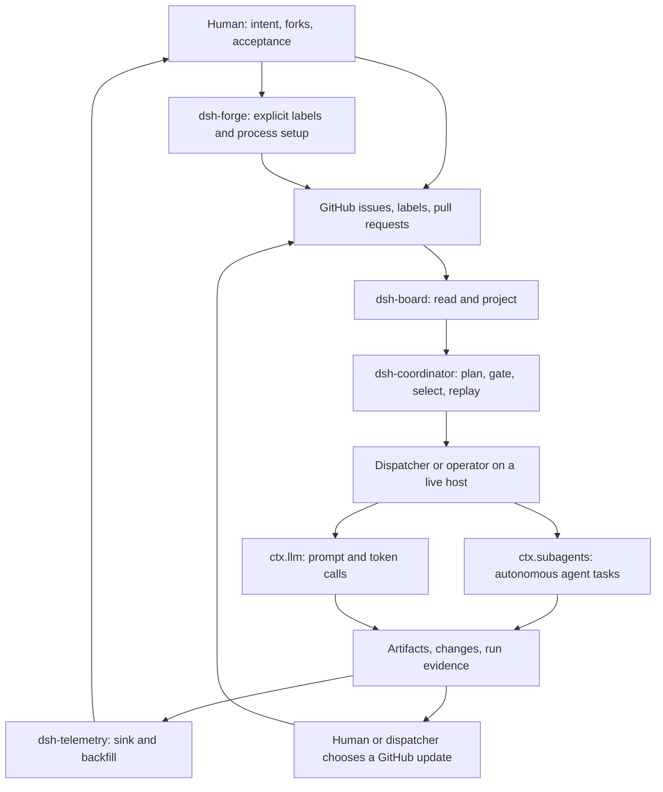

# Plan — public-docs-relaunch--e10

**Stage E draft for E10 child [#209](https://github.com/rickylabs/harness/issues/209), under #140, and
for independent review. No product or public-document mutation is authorized by this artifact.** Rewrite
the README from scratch as a truthful presentation of the deterministic coordinator
layer, then align the minimum supporting Markdown needed to keep each fact in one home. The first screen
will explain the problem, system loop, and human/agent split. Installation follows only after the reader
knows what the clone can and cannot do.

## Outcome and acceptance

The completed E10 lane will let a new reader answer, in order:

1. What problem does harness solve?
2. What does a human decide, what does an agent do, and what does the deterministic layer enforce?
3. How do GitHub board truth, the coordinator, the two model seams, and telemetry connect?
4. Which surfaces are implemented, composed, host-dependent, or stubs at the exact merge baseline?
5. Which path should an evaluator, contributor, adopter, or operator take next?
6. Which local command proves the first useful behavior without claiming a live swarm?

Acceptance requires all README behavioral and status claims to have a row in the claim inventory, all
relative links and generated CLI docs to pass their existing checks, every documented command to be
executed in a clean fixture, and an independent reviewer to return an allowed verdict against the exact
documentation commit.

## Decisions

### D1 — The README teaches the system before installation

**Decision.** Lead with proposition → pain → system loop → human/agent boundary → honest status → paths;
put installation after that sequence.

**Rationale.** The current README introduces commands at lines 31–74 but does not show the architecture
until lines 115–151 or motivation until lines 202–216
([`research.md`](research.md#1-the-front-door-starts-in-the-middle-of-the-story)). NetScript's pinned
front door demonstrates that a proposition and end-to-end model can precede detailed capability and
quickstart material.

**Alternative rejected.** Editing the present README section-by-section would preserve its command-first
structure and make “from scratch” a copy edit.

### D2 — Status is a matrix, not a single shipped flag

**Decision.** Use the four labels `Implemented`, `Composed`, `Host-dependent`, and `Stub`, with every row
resolved from source at the implementation merge baseline.

**Rationale.** Provider code can be implemented while the profile's registry remains empty, and the
private profile is checkout-bound ([`research.md`](research.md#3-shipped-is-not-one-state)).

**Alternative rejected.** A green/red package table conflates source existence, profile wiring, and live
host availability.

### D3 — One compact Mermaid diagram is the README's visual anchor

**Decision.** Use repository-native Mermaid plus a prose fallback immediately below it. Keep detailed
two-seam economics on its owning concept page.

**Rationale.** The relationship has more than three downstream paths and is easier to assess as a flow.
Mermaid remains reviewable text and needs no image generation or site technology. The EIS-Chat dependency
diagram and Ledgerline hierarchy findings support the presentation form; harness code supplies all nodes
and arrows ([`research.md`](research.md#2-the-public-mental-model-must-separate-three-actors)).

**Alternative rejected.** A bespoke screenshot or raster illustration would add an asset lifecycle and
could make aspirational behavior look live.

### D4 — Rewrite in bounded waves from authorities outward

**Decision.** Land the claim inventory first, then README, then only the concept/navigation/tutorial pages
whose claims or links must change. Generated CLI reference stays generated.

**Rationale.** Existing semantic drift shows that a broad prose rewrite without owners creates another
stale copy. Generated CLI documentation already has a byte-comparison gate
([`scripts/cli-reference.mjs:1-20`](../../../scripts/cli-reference.mjs)).

**Alternative rejected.** Rewriting all documentation at once expands review surface without improving
the front-door argument.

## Proposed README architecture

The implementation may refine sentences, but it must preserve this order and evidence boundary.

1. **Hero:** repository name; one sentence: deterministic coordinator layer for agent swarms; badges;
   links to “Understand the loop,” “Try a local proof,” board, and docs.
2. **The bottleneck:** agent output exceeds human review/coordination capacity; status should be readable
   without interrupting an agent. Avoid competitor comparisons unless independently refreshed and cited.
3. **How the layer works:** the diagram below plus a five-sentence walkthrough. State explicitly that
   GitHub is board truth and workflow execution needs an operator/dispatcher/live host.
4. **Who decides what:** three-column table for human, agent, deterministic layer. Put owner forks,
   stochastic work, and mechanical reads/gates/evidence in separate columns.
5. **What exists at this baseline:** compact status matrix using D2, with baseline SHA/date. Link to the
   board for moving status and package docs for behavior.
6. **Choose your path:** evaluator, contributor, adopter, operator. Each gets one outcome-oriented link.
7. **Local proof first:** prerequisites, build, `dsh-coordinator policies`, then optional board/profile/
   telemetry proofs clearly marked by transport or host prerequisite.
8. **Architecture commitments:** two seams, GitHub authority, generated artifacts, durable evidence;
   each summary links to one owning concept/doctrine page.
9. **Packages:** secondary inventory, grouped by role and status rather than a flat implementation dump.
10. **Contributing and license:** existing contribution entry points and MIT license.

### Concrete proposed diagram



The caption must say: harness currently supplies the deterministic decisions and services shown; it does
not by itself supply a continuously running, fully wired dispatcher. The evidence-to-GitHub path is an
explicit human or dispatcher action; `dsh-board` only reads and projects GitHub. `dsh-forge` is the
separate, explicit mutation boundary for applying label/process setup, with create/update methods in its
GitHub transport
([`packages/board/src/github.ts:105-126`](../../../packages/board/src/github.ts),
[`packages/forge/src/labels/github.ts:34-43`](../../../packages/forge/src/labels/github.ts),
[`packages/forge/src/labels/github.ts:87-109`](../../../packages/forge/src/labels/github.ts)).
`ctx.subagents` and `ctx.llm` are separate seams. The profile currently composes an empty subagent
registry, while local LLM routes remain dependent on reachable backends and credentials
([`packages/dsh-app/src/plugins/subagents.ts:80-97`](../../../packages/dsh-app/src/plugins/subagents.ts),
[`packages/dsh-app/src/plugins/llm.ts:96-124`](../../../packages/dsh-app/src/plugins/llm.ts)).

## Audience paths

| Reader | First promised outcome | Route |
| --- | --- | --- |
| Evaluator/reviewer | Understand gates, evidence, and evaluator independence | diagram → human/agent split → doctrine workflow → coordinator concepts/reference |
| Contributor | Find current implementation truth and a safe change surface | status matrix → package map → contributing/checks |
| Adopter experimenting locally | Prove deterministic behavior without a daemon | local proof → tutorial → generated CLI reference |
| Operator with a live host | Understand profile wiring and external prerequisites | status matrix → deploy README → profile/provider package docs |

The README must not route a newcomer directly into the N5 deployment as if it were a general install;
`deploy/README.md` says it encodes one box ([`deploy/README.md:1-12`](../../../deploy/README.md)).

## Bounded rewrite waves

### W1 — Freeze claims before prose

Create a checked-in implementation worksheet in the E10 run or PR description containing every new
README claim, its authority, status label, and reviewer disposition. Re-resolve package status against
the exact merge baseline. Record contradictions rather than choosing a friendlier wording.

**Gate:** no README draft until every architecture arrow and status row has a source path and line.

### W2 — Replace the root README

Write the outline above from a blank buffer. Reuse facts and links, not current section order or copy.
Keep the README useful on GitHub without a site renderer. Do not add host paths, credentials, private
telemetry, or claims inferred from the live board.

**Gate:** inspect a GitHub-rendered preview at 375 CSS pixels and the Markdown source wrapped to 80
columns. Pass when the proposition and first explanatory sentence require no horizontal scroll, tables
and Mermaid remain contained/scrollable rather than clipping the page, every diagram relationship is
also stated in prose, headings remain distinguishable without color, installation occurs after the
mental model, and the status matrix uses only D2 terms. W5 repeats this criterion independently.

### W3 — Repair the immediate docs path

Update `docs/README.md` navigation and the smallest set of concept pages needed to remove contradictions
introduced or exposed by W2. At minimum, correct lines 126–127 of the stale “What is actually built”
section in `docs/concepts/02-the-two-seams.md`: `provider-claude`, `provider-opencode`, and `llm-local`
are implemented; `provider-codex` and `provider-acp` remain stubs; the profile's subagent registry remains
empty; and local routes remain host-dependent. Preserve one owner per fact: concept pages explain why;
package README/source states behavior; generated CLI pages state flags and exit codes
([`research.md`](research.md#auditable-claim-inventory-for-implementation)).

**Gate:** a search for `stub`, `ships`, `shipped`, `today`, and provider names has a disposition for each
status-bearing sentence.

### W4 — Validate the reader journeys and commands

Execute each documented command from a clean checkout or isolated temporary directory. Separate proof
classes:

- offline: install dependencies, build, CLI `--help`, `dsh-coordinator policies`, generated-doc check;
- fixture-only: profile `install --dry-run` with an explicit temporary `--home`, coordinator commands
  with checked-in sample input, telemetry only with synthetic events and explicit temporary `--home`;
- network/host: board GitHub access, provider sessions, local model servers, and deployed web surface;
  document prerequisites, but do not claim they passed unless an authorized public fixture run proves it.

No validation may read the operator's default home, credentials, vendor transcripts, or live private host
state.

### W5 — Independent review

Give a separate model/session the exact diff, claim inventory, baseline SHA, and command receipts. The
review prompt asks it to find unsupported status, arrows that imply unshipped automation, duplicated fact
ownership, broken audience paths, inaccessible diagram semantics, failure of the 375-pixel/80-column W2
criterion, and commands that were not actually run. Apply narrow fixes and re-run the checks before
landing.

**Gate:** verdict `PASS` or `PASS AFTER NARROW FIXES` with every finding dispositioned against the exact
reviewed commit.

## Command validation matrix

| Surface | Validation | Required result |
| --- | --- | --- |
| Markdown graph | `pnpm run check:links` | exit 0; no broken relative path or anchor |
| Generated CLI docs | `pnpm run check:docs` after package build | exit 0; generated pages match binaries |
| Workspace | `pnpm run typecheck && pnpm run build && pnpm test` | all exit 0 on the documentation head |
| Five CLI entry points | invoke each documented `--help` | exit 0 and synopsis matches generated reference |
| First local proof | `node packages/coordinator/dist/cli.js policies` | exit 0; both policies and default printed |
| README command blocks | execute a script that extracts/records each block or maintain a receipt table | every executable block has a passing receipt or an explicit host/network classification |
| Public safety | search changed public docs for absolute home paths, token variable values, transcript paths, private host facts | zero leaked values; general variable names and documented prerequisites only |

The workspace row is the authoritative aggregate receipt: root `build` already invokes link and
generated-doc checks ([`package.json:12-24`](../../../package.json)). The first two rows are retained as
focused diagnostic outputs for reviewers and are not counted as additional acceptance receipts.

The baseline evidence already passes link, generated-doc, five-help, and policy checks
([`research.md`](research.md#current-executable-evidence)); implementation repeats them against its own
head and adds full workspace and command-block validation.

## Dependency DAG

```text
W1 claim inventory
  └─> W2 root README
       ├─> W3 immediate docs repair
       └─> W4 reader/command validation
              └─> W5 independent review
                    └─> narrow fixes + repeat W4
```

README architecture can start as soon as W1 resolves the current merge baseline; it does not wait for
all other MVP work. If upstream changes land during the lane, update the inventory and record the baseline
change before revising status prose.

## Risk register

| Risk | Likelihood | Impact | Gate |
| --- | --- | --- | --- |
| README implies an autonomous loop that code does not execute | High | High | W1 arrow inventory; W5 adversarial prompt |
| Implemented provider is described as live/composed | High | High | D2 matrix; source check of profile registry |
| Moving baseline makes status stale before merge | Medium | High | re-pin inventory at implementation start and pre-review |
| Concept pages retain contradictory status | High | Medium | W3 status-term search |
| Attractive diagram hides host prerequisites | Medium | High | mandatory caption and prose fallback |
| Quickstart reads private/default home or needs credentials | Medium | High | W4 isolated fixtures; public safety search |
| Broad docs rewrite duplicates authorities | Medium | Medium | bounded W3 surface; claim owner per row |
| Docs-site or cockpit work enters scope | Low | High | mutation manifest excludes site/cockpit surfaces; issue #148 remains unstarted |
| Generated reference edited by hand | Low | Medium | `pnpm run check:docs` byte comparison |

## Spikes

No spike blocks the presentation rewrite. Any desired claim that a provider dispatches successfully on a
real host, that a local backend is reachable, that the deployed web surface is publicly usable, or that a
continuous orchestration loop is operating must remain absent until its owning implementation lane
provides a public receipt. E10 does not gather private host evidence to manufacture one.

## Owner forks

None. Owner steer already fixes the material choices for this lane: from-scratch public README/docs,
mental model before install, honest shipped/partial/stub status, live-host limitation, public evidence
only, no cockpit, no docs-site decision, and no publishing action. Copy tone, brand art, docs engine, and
publication are outside this plan rather than silently decided.

## Mutation manifest for implementation

Allowed after plan evaluation:

- `README.md`
- `docs/README.md`
- the minimum existing `docs/concepts/*.md`, `docs/tutorials/*.md`, and `docs/how-to/*.md` pages named by
  W3/W4 findings
- E10 run artifacts and review receipts

Excluded:

- product code and package behavior
- generated `docs/reference/cli/*` except through its existing generator after a genuine CLI change
- docs-site scaffolding, hosting, theme, or engine selection (#148)
- cockpit repositories or cockpit code
- package versions, publishing, release tags, contracts release workflow
- GitHub issues, labels, milestones, board mutations, or dispatch triggers
- sibling repository mutation, private host inspection, credentials, and user-home telemetry

The implementation PR should remain a presentation deliverable. Any code change discovered while proving
a claim becomes a separately owned issue or lane; it is not absorbed into E10.
