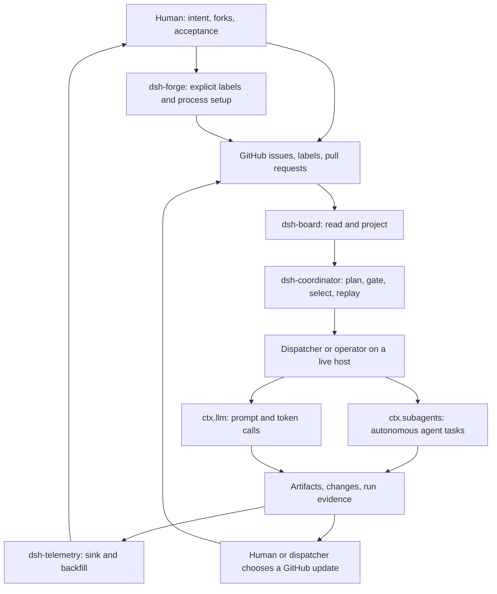

# harness

[](https://github.com/rickylabs/harness/actions/workflows/ci.yml)
[](LICENSE)
[](https://nodejs.org)
[](https://github.com/deepseek-ai/deepseek-harness)

**The deterministic coordinator layer for an agent fleet.** A monorepo of
[DeepSeek Harness](https://github.com/deepseek-ai/deepseek-harness) (`dsh`)
plugins that turn a GitHub repository into a board, decide what may run next,
and tell you what the fleet did — without waking an agent to ask.

[Understand the loop](#how-the-layer-works) | [Try a local proof](#local-proof-first) |
[The board](BOARD.md) | [Documentation](docs/)

---

## Why this exists

An agent can write code all night. What it cannot do is tell you, reliably,
what it did, whether it was allowed to, and who should check it — the moment
you ask, you are interrupting it, and its answer about itself is an account
from memory, not a record.

Harness exists so the human/agent split has a substrate. A human holds the
decisions that need a person: what the fleet should work on, which fork gets
the owner's call, what counts as accepted. Agents hold the work: research,
implementation, review. Between them sits a deterministic layer that projects
the work onto a board, decides what may run next, gates every change behind
an explicit check, and records what happened.

The bottleneck this targets is not code production. Coding agents produce
output faster than humans can review it; the scarce resource is coordination
and review — knowing what ran, what it changed, whether it may proceed, and
who is allowed to say so, read from disk rather than interrupting a session.

The method is not new here. The doctrine this repository encodes ran across
three codebases with nothing in common — a Deno runtime spine, a Deno chat
harness at depth, and a Next.js marketing site — and transferred cleanly for
mechanics and not at all for domain knowledge. That asymmetry is the product
seam: **mechanics are portable, knowledge is specific.** The prior-art table
in [`AGENTS.md`](AGENTS.md) names all three.

## How the layer works

Three actors, one loop. The diagram is the whole system; the prose under it
walks every arrow, and the paragraph after that states exactly which parts of
the picture this repository supplies at this baseline.



The loop, arrow by arrow:

1. A **human** holds intent where the work already lives: GitHub issues,
   labels and pull requests. When a repository needs this board process at
   all, a human runs **`dsh-forge`** explicitly, and forge writes the label
   taxonomy to that repository's GitHub — setup, on purpose, not in passing.
2. **`dsh-board`** reads GitHub and projects it: columns, a hierarchy view, a
   digest page, and a check that names every way the board contradicts
   itself. When it does, every terminal view says so — a banner above the
   work, with the affected rows marked — and the check carries the detail.
   It writes nothing back; its GitHub transport is read-only by
   construction.
3. **`dsh-coordinator`** answers the deterministic questions over state
   derived from that projection: what may run next, whether a step's gates
   passed, and who may review whose work. Deciding and doing are separate
   jobs — the workflow is inert data, and performing an effect belongs to a
   caller.
4. That caller is a **dispatcher or operator on a live host**. Work reaches
   models through one of two seams and never both at once: autonomous vendor
   CLIs at **`ctx.subagents`**, and prompt-completion calls at **`ctx.llm`**.
5. Both seams leave **artifacts, changes and run evidence** behind.
   **`dsh-telemetry`** sinks and backfills that record, and a human can read
   it from disk with no agent awake — which closes the loop where it started:
   intent in, legible status out.
6. Evidence does not write itself back to GitHub. A **human or dispatcher
   chooses** the update — a comment, a label move, a pull request — and that
   choice is what lands on the board.

**What this repository supplies, and what it does not.** Harness is the
deterministic decisions and services in that diagram: the projection, the
gates, the seam contracts, the record and the replay. It does not by itself
supply a continuously running, fully wired dispatcher — nothing here
schedules these services or writes the coordinator's state file yet; a
durable loop is an open lane, not a shipped one. `dsh-board` only reads and
projects GitHub; every terminal view flags a board that contradicts itself,
and its check names the detail. `dsh-forge` is the separate, explicit
mutation boundary, scoped to label and process setup, with named create/update calls
in its GitHub transport. The two seams stay distinct: the profile currently
composes an **empty** subagent registry — a dispatch into it returns a named
`no-providers` refusal rather than a crash — while the local LLM routes are
registered but remain dependent on reachable backends and credentials at
dispatch time.

## Who decides what

| A human decides | An agent does | The layer enforces |
| --- | --- | --- |
| Intent: issues, labels, milestones, pull requests | The stochastic work: research, implementation, review | Projection: GitHub → board views; every terminal view flags a self-contradiction; `check` names it; a half-seen board is refused |
| Owner forks: whatever depends on what the owner wants | Lifecycle moves on its own item — one `status:` label at a time, per the generated skill | Eligibility: what may run next; every effect step must have a gate upstream, checked not promised |
| Acceptance: merges, closes, consequential writes | Recording evidence as it works | Independence: an author never evaluates its own artifact; no legal evaluator is a blocker, never a softer rule |
| Running `dsh-forge` to install labels and process | — | Replay: decisions re-run from their own inputs; a different answer is reported as nondeterminism |

The middle column is where all the intelligence in this system lives, and the
outer two are why it can be trusted: humans keep the decisions that are
theirs, agents keep the work that is theirs, and the layer in between never
improvises — it is pure functions over declared data, which is what makes it
auditable at all.

## What exists at this baseline

**Status** moves on the board, not in this file: [BOARD.md](BOARD.md) is
regenerated from GitHub every half hour, and the
[E0 roadmap](https://github.com/rickylabs/harness/issues/30) is what is built
and what is not. What follows is a snapshot — every row resolved from source
at commit `c98fbeb` (2026-09-07, then `main`), meant to be re-resolved, not
remembered; [the board](BOARD.md) carries whatever moved since.
The labels are exact: **Implemented** — source and meaningful tests exist
here; **Composed** — the `dsh-app` profile actually registers it;
**Host-dependent** — use needs a live provider, server, credential or
transport a clone does not supply; **Stub** — a placeholder reserving
dependency shape. Nothing in this matrix is a running swarm, and no row
claims one. On a narrow screen, tables scroll sideways. Use the diagram's
zoom controls or read the walkthrough below.

| Surface | Status | What that means here |
| --- | --- | --- |
| Five CLIs: `dsh-board`, `dsh-coordinator`, `dsh-telemetry`, `dsh-forge`, `dsh-profile` | Implemented | built and tested; each `--help` is byte-compared into the generated reference |
| The `dsh` profile | Composed | five plugin rows registered; the profile is bound to this checkout and not published |
| `ctx.subagents` seam | Composed — empty | zero registered providers; a dispatch returns the named `no-providers` refusal |
| `provider-claude`, `provider-opencode` | Implemented — not composed | the profile registers neither; running them is Host-dependent (an injected SDK with credentials; a live `opencode serve`) |
| `ctx.llm` seam | Composed | the adapter registers all three routes — `lm-studio`, `llama-rocm`, `openrouter`; every destination is Host-dependent at dispatch |
| Board session projection | Composed | strict public projection plus todo writes over published `dsh` session services, proven by a synthetic composition smoke, not a daemon boot; carries task phase, run completeness, and — since [#220](https://github.com/rickylabs/harness/issues/220) — every board anomaly with its detail, the kinds naming each item, and the fetch coverage, so a pane can say a column is disputed without shelling out to `check` |
| Governance display | Implemented | `dsh-telemetry tree`/`status` reads a typed observation file — quota, spend, capacity, refusals, each with its age; absent input reads UNKNOWN, never "all clear". The live host adapter is blocked on [#62](https://github.com/rickylabs/harness/issues/62) |
| `provider-codex`, `provider-acp`, `governance`, `netscript-bridge` | Stub | each README opens with `Status: stub` and names its blocking epic |
| `contracts` | Implemented | the only publishable package; release is tag-triggered, and no registry release is claimed here |
| GitHub transports; `deploy/` stack | Host-dependent | GitHub board reads and label checks need a working transport; verify `init` with `labels check` and a live readback. The compose stack targets one specific box |

## Choose your path

| You are… | Go | First outcome |
| --- | --- | --- |
| evaluating or reviewing | the diagram above → [doctrine/WORKFLOW.md](doctrine/WORKFLOW.md) → [concepts](docs/concepts/) | how work is staged, gated and independently reviewed, and what counts as evidence |
| contributing | the status matrix → [packages/README.md](packages/README.md) → [CONTRIBUTING.md](CONTRIBUTING.md) | the current implementation truth and a safe change surface |
| adopting locally | [local proof](#local-proof-first) → the [tutorial](docs/tutorials/01-from-clone-to-board.md) | deterministic behavior proven on your machine, without a daemon |
| operating a live host | the status matrix → [deploy/README.md](deploy/README.md) → [dsh-app](packages/dsh-app/README.md) and provider docs | profile wiring and every external prerequisite, named |

## Local proof first

What a clone can do, offline, is prove the deterministic half. Node 24 is the
declared and recommended baseline, alongside [pnpm](https://pnpm.io) 11:

```bash
pnpm install
pnpm run build
```

`build` is not only a compile — it runs eight repository-wide checks around
it. Two of them guard documents: every generated CLI reference page is
byte-compared against its binary, and every relative link and anchor is
resolved. What they check is exactly what they check — generated pages and
links, not hand-written prose. Pasted output in prose is checked by nobody —
[#212](https://github.com/rickylabs/harness/issues/212) is the standing
counter-example, and the reason this README pastes almost none. The rule the
gap is measured against lives on the
[docs index](docs/README.md#the-rule-these-docs-are-held-to).

Then the first proof. It needs nothing but the build — no network, no
credentials, no home directory:

```bash
node packages/coordinator/dist/cli.js policies
```

It prints the two evaluator-independence policies and which one is the
default, plus the guarantee that holds under both: a session never evaluates
itself, and a roster with no legal evaluator is a blocker rather than
permission for same-family review.

Five command-line tools exist, deliberately separate binaries rather than
subcommands of one. Each reads a different source of truth — the GitHub API,
a state file on stdin, a log directory on disk, the repository you are
standing in — and each answers a question you would otherwise have to ask an
agent:

| Command | Package | The question it answers |
| --- | --- | --- |
| `dsh-board` | [`board`](packages/board) | What is on the board right now — and does it contradict itself? |
| `dsh-coordinator` | [`coordinator`](packages/coordinator) | May this step run? Who is allowed to review it? What changed since last time? |
| `dsh-telemetry` | [`telemetry`](packages/telemetry) | What did the fleet actually do — read from disk, with nothing awake? |
| `dsh-forge` | [`forge`](packages/forge) | Install this board process into any repository. |
| `dsh-profile` | [`dsh-app`](packages/dsh-app) | Compose every plugin into one `dsh` profile. |

<details>
<summary>Why <code>node packages/…/dist/cli.js</code> and not the bare command name</summary>

Every package here except `contracts` is `private: true`, so pnpm links their
bins where a *dependent* resolves them — not at the repository root. Running
the built entry point directly is the honest invocation from a fresh clone,
and it is what the repository's own scripts do (see `skill:install` in the
root `package.json`). Installing the profile with `dsh-profile install` is
what puts them somewhere a `dsh` process can find them.

</details>

Further proofs, by what they need:

- **Offline, isolated fixtures.** See what the profile installer would write,
  without writing it: `node packages/dsh-app/dist/cli.js install --dry-run
  --home /tmp/dsh-home`. Ask telemetry where it would keep its log: `node
  packages/telemetry/dist/cli.js where --home /tmp/tel-home`. Render the
  governance display from a synthetic observation file — the fixture and its
  commands live in the
  [telemetry README](packages/telemetry/README.md#synthetic-governance-fixture),
  and every value in it is synthetic by construction.
- **Network: `gh` or `GITHUB_TOKEN`.** `dsh-board columns` projects a
  repository; `dsh-board digest` prints the markdown page
  [BOARD.md](BOARD.md) is made of; `dsh-forge doctor` reports what a target
  repository and your environment support. The tools whose whole job is
  reading GitHub exit **3** and say so when no transport is available. Two
  forge commands are deliberately not in that set: `doctor` exits **0** and
  reports what it could see, and `init` exits **0** having written its local
  files even when the GitHub half was skipped — which is why the tutorial
  ends that step with a readback that can fail loudly.
- **A live host.** Provider sessions (an injected Claude Agent SDK; a
  long-lived `opencode serve`), local model servers behind the `ctx.llm`
  routes, and the [deployed web surface](deploy/README.md) all need machines
  and credentials this repository does not supply. The docs state those
  prerequisites; nothing here claims they passed.

To be walked through the whole thing once — building, installing the board
process into a repository of your own, moving an item, composing the profile,
recording a run and reading it back —
[From a clone to a moving board](docs/tutorials/01-from-clone-to-board.md) is
fifteen minutes and needs no server.

## Architecture commitments

Scope first, so the rest is readable: this repository is the `dsh` plugin
layer, the doctrine those plugins encode, and the run artifacts they produce
— nothing else. Private external consumers live in separate repositories (such
as a cockpit and a mobile client we run against it), reaching this layer over a
published contract package (ratified decision 4, below).

Four commitments shape every package. Each is summarized once here and owned
in full by exactly one page, because a fact in two places is a future
contradiction.

- **Two seams, not one.** Subscription agent CLIs and API-key or local models
  attach to different `dsh` services, are metered differently, and running
  out of one does not resemble running out of the other. Collapsing them is
  the design error the package split exists to prevent.
  [02 — Two seams](docs/concepts/02-the-two-seams.md) owns the argument.
- **GitHub holds board truth.** There is no second database of task state.
  `dsh-board` projects issues, labels and pull requests, refuses to report a
  board it only half saw, and flags a board that contradicts itself in every
  terminal view — `check` names the contradictions and exits non-zero;
  `digest` prints them with the repair. The session projection carries the
  same anomalies with their detail, the kinds naming each item, and the fetch
  coverage, so a pane can say a column is disputed without shelling out
  ([#220](https://github.com/rickylabs/harness/issues/220)). `dsh-forge` is
  the one explicit write boundary, and it writes labels, never evidence.
  [03 — The board](docs/concepts/03-the-board.md) owns the reasoning.
- **Everything generated is generated.** Six artifacts in this repository are
  produced by code and five are byte-compared against it on every build; the
  sixth, BOARD.md, is rewritten wholesale every half hour, so an edit to it
  is reverted rather than rejected. [CONTRIBUTING.md](CONTRIBUTING.md) owns
  the table and the regeneration commands;
  [05 — Determinism](docs/concepts/05-determinism.md) owns why drift is a
  correctness bug.
- **Artifacts over chat, with citations.** A conclusion that exists only in a
  conversation does not exist; run directories under `.llm/runs/` are
  committed, reviewed and kept. Every load-bearing claim carries a path, a
  page or a URL. [doctrine/PRINCIPLES.md](doctrine/PRINCIPLES.md) owns the
  rules; [04 — What "run" means](docs/concepts/04-the-run.md) owns the word's
  two meanings.

### Ratified decisions

Four decisions are **ratified** in the *Decisions taken* table of the
[E0 roadmap](https://github.com/rickylabs/harness/issues/30). They are
restated here because root documents are what an agent reads first, and a
root document that contradicts a ratified decision propagates the
contradiction silently. They are not re-opened in a run, a PR, or a prompt;
reversing one is a change to #30 first.

1. **Plugin-only, no core fork.** Depend on published
   [`@deepseek-ai/dsh`](https://github.com/deepseek-ai/deepseek-harness). We
   ship Cordis plugin packages and one profile. Only
   [`runzhliu/deepseek-harness-docker`](https://github.com/runzhliu/deepseek-harness-docker)
   is forked, with the upstream remote kept for updates.
2. **Node + pnpm.** netscript stays a service behind an adapter, not a
   build-time dependency.
3. **GitHub is the source of truth for the board**; `dsh` projects the live
   view.
4. **This repo is the `dsh` layer only.** No cockpit is built here. Private
   external consumers live in separate repositories (such as a cockpit and a
   mobile client we run against it). Consequence: `contracts` must be a
   *published* package, not a workspace import.

Decision 4 originally placed external consumers inside `rickylabs/netscript` and
was amended on
[#30](https://github.com/rickylabs/harness/issues/30)
once they became products in their own right; the published contract package
is still the only thing this repository owes them. Two further decisions —
the MIT licence with a public npm scope, and the divybot/herdr strangler-fig
— are recorded on #30 as **taken, reversible**; read them on the board.

## Packages

Fifteen packages, grouped by what they are for. The authoritative package →
epic → attachment table is [packages/README.md](packages/README.md); this
list is the orientation, at the baseline above.

- **Decide, project, record** — [`coordinator`](packages/coordinator),
  [`board`](packages/board), [`telemetry`](packages/telemetry). Implemented,
  and Composed as profile rows. The five CLIs above are their faces.
- **The subagents seam** — [`subagents`](packages/subagents) holds the
  contract itself; [`provider-claude`](packages/provider-claude) and
  [`provider-opencode`](packages/provider-opencode) are Implemented against
  it and not registered by the profile;
  [`provider-codex`](packages/provider-codex) and
  [`provider-acp`](packages/provider-acp) are Stubs. The composed registry is
  empty.
- **The llm seam** — [`llm-local`](packages/llm-local) (destinations,
  capabilities, budgets) and [`routing`](packages/routing) (the model matrix)
  are Implemented; the profile Composes the adapter for all three routes;
  each destination stays Host-dependent.
- **Compose and publish** — [`dsh-app`](packages/dsh-app) is the profile and
  bundle patch; [`contracts`](packages/contracts) is the wire protocol external
  consumers consume and the only publishable package;
  [`forge`](packages/forge) installs the board process into any repository
  and is CLI-only — it needs no profile row.
- **Reserved** — [`governance`](packages/governance) and
  [`netscript-bridge`](packages/netscript-bridge) are Stubs waiting on their
  epics, and say so in their first lines. A stub is a `package.json`, a
  tsconfig and a placeholder: enough to hold its place in the project graph
  so the dependency shape is decided before the code is written, and not
  enough to pretend it works.

### Repository map

```
packages/             the dsh plugin layer — one package per subsystem
docs/                 concepts, tutorials, how-to, reference, glossary
doctrine/             how to work here: portable, stable, no runtime
deploy/               the N5 compose stack and the patch overlays it applies
scripts/              the repository-wide checks the root scripts run
.llm/runs/            run artifacts — durable, reviewed via PR
.llm/harness/         the artifact templates a run fills in
.llm/tools/           milestone and gate tooling (Deno; see below)
.github/labels.yml    the ejected label taxonomy — generated, then reviewed
.github/workflows/    the CI gate, the release pipeline, the status-label settler, the board
.claude/skills/       the generated board skill (`pnpm run skill:install`)
BOARD.md              the published board — generated every half hour, never hand-edited
AGENTS.md             entry point, agent mode
CLAUDE.md             entry point, standard mode
deno.json             see below
```

`deno.json` and `deno.lock` at the root of a pnpm monorepo look like debris
and are not: they run the milestone and gate tooling under `.llm/tools/`.
Whether that second toolchain stays is an open owner fork, recorded on
[#140](https://github.com/rickylabs/harness/issues/140).

## Contributing

This repository **is** an agent inbox. An issue labelled `harness` is polled
every thirty seconds and dispatched to a real agent on a real host, with no
confirmation step. That is a feature, not a hazard, but it means the label
starts something. Label deliberately —
[`AGENTS.md`](AGENTS.md#operational-hazard-this-repository-is-a-live-inbox)
owns the full statement of what follows from that.

Most pull requests here are opened by an agent, and the rules that matter are
the ones a machine can check: [`CONTRIBUTING.md`](CONTRIBUTING.md) owns the
four-command local loop, the branch and PR conventions, and the generated
files you must not hand-edit.

| File | What it settles |
| --- | --- |
| [`CONTRIBUTING.md`](CONTRIBUTING.md) | The local loop, conventions, and the six generated files |
| [`SECURITY.md`](SECURITY.md) | Three surfaces an ordinary repository does not have: content that instructs an agent, a label that executes, and run artifacts that are committed |
| [`GOVERNANCE.md`](GOVERNANCE.md) | Where a decision lives, and the owner-fork rule that makes autonomous work safe here |
| [`SUPPORT.md`](SUPPORT.md) | Where to go for each kind of question, given that there are no Discussions |
| [`CODE_OF_CONDUCT.md`](CODE_OF_CONDUCT.md) | Short. An agent's output is its operator's responsibility. |

## Licence

**MIT**, matching `dsh`, so the plugin packages can carry the `dsh-plugin`
topic. Taken on [#30](https://github.com/rickylabs/harness/issues/30) as
reversible. See [`LICENSE`](LICENSE).
