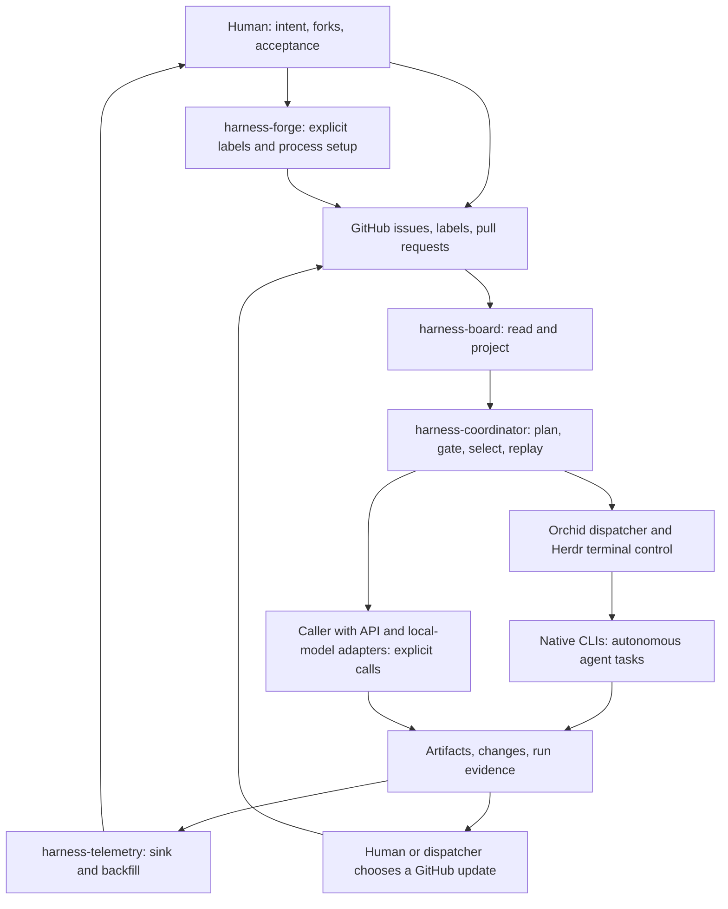

# harness

[](https://github.com/rickylabs/harness/actions/workflows/ci.yml)
[](LICENSE)
[](https://nodejs.org)
[](ARCHITECTURE.md)

**Our portable agent framework, built on Orchid and Herdr.** Routing, native
activity, board and coordination tools, published contracts, profiles and the
method make agent work governed and observable. The retained DeepSeek Harness
integration is an optional additional-router experiment, not the framework's host.
[ADR 0005](method/doctrine/decisions/0005-harness-framework-identity.md) records the owner decision.

[Understand the loop](#how-the-layer-works) | [Try a local proof](#local-proof-first) |
[The board](BOARD.md) | [Documentation](docs/)

---

## Why this exists

An agent can write code all night. What it cannot do is tell you, reliably,
what it did, whether it was allowed to, and who should check it — the moment
you ask, you are interrupting it, and its answer about itself is an account
from memory, not a record.

Harness exists so the human/agent split has a substrate. A human holds the
decisions that need a person: what the fleet should work on, which fork gets
the owner's call, what counts as accepted. Agents hold the work: research,
implementation, review. Between them sits a deterministic layer that projects
the work onto a board, decides what may run next, gates every change behind
an explicit check, and records what happened.

The bottleneck this targets is not code production. Coding agents produce
output faster than humans can review it; the scarce resource is coordination
and review — knowing what ran, what it changed, whether it may proceed, and
who is allowed to say so, read from disk rather than interrupting a session.

The method is not new here. The doctrine this repository encodes ran across
three codebases with nothing in common — a Deno runtime spine, a Deno chat
harness at depth, and a Next.js marketing site — and transferred cleanly for
mechanics and not at all for domain knowledge. That asymmetry is the product
seam: **mechanics are portable, knowledge is specific.** The prior-art table
in [`AGENTS.md`](AGENTS.md) names all three.

## How the layer works

The diagram shows responsibility boundaries. Orchid owns native dispatch and
Herdr owns terminal control; configured providers and observed sources determine
which paths are usable. Core executables use `harness-*` names; temporary `dsh-*`
aliases keep existing callers working without requiring a dsh host.


```mermaid
flowchart TD
  H[Human: intent, forks, acceptance] --> G[GitHub issues, labels, pull requests]
  H --> F[harness-forge: explicit labels and process setup]
  F --> G
  G --> B[harness-board: read and project]
  B --> C[harness-coordinator: plan, gate, select, replay]
  C --> D[Orchid dispatcher and Herdr terminal control]
  D --> S[Native CLIs: autonomous agent tasks]
  C --> L[Caller with API and local-model adapters: explicit calls]
  S --> E[Artifacts, changes, run evidence]
  L --> E
  E --> T[harness-telemetry: sink and backfill]
  T --> H
  E --> A[Human or dispatcher chooses a GitHub update]
  A --> G
```

The loop, arrow by arrow:

1. A **human** holds intent where the work already lives: GitHub issues,
   labels and pull requests. When a repository needs this board process at
   all, a human runs **`harness-forge`** explicitly, and forge writes the label
   taxonomy to that repository's GitHub — setup, on purpose, not in passing.
2. **`harness-board`** reads GitHub and projects it: columns, a hierarchy view, a
   digest page, and a check that names every way the board contradicts
   itself. When it does, every terminal view says so — a banner above the
   work, with the affected rows marked — and the check carries the detail.
   It writes nothing back; its GitHub transport is read-only by
   construction.
3. **`harness-coordinator`** answers the deterministic questions over state
   derived from that projection: what may run next, whether a step's gates
   passed, and who may review whose work. Deciding and doing are separate
   jobs — the workflow is inert data, and performing an effect belongs to a
   caller.
4. That caller is a **dispatcher or operator on a live host**. Work reaches
   models through separate native-task and API/local-model boundaries. Native
   CLIs own their loops; adapters own the call semantics they actually implement.
5. Both seams leave **artifacts, changes and run evidence** behind.
   **`harness-telemetry`** sinks and backfills that record, and a human can read
   it from disk with no agent awake — which closes the loop where it started:
   intent in, legible status out.
6. Evidence does not write itself back to GitHub. A **human or dispatcher
   chooses** the update — a comment, a label move, a pull request — and that
   choice is what lands on the board.

Harness owns the deterministic mechanism in this loop: board projections,
routing and admission evidence, execution gates, provider adapters, telemetry, and durable
intents and receipts. GitHub holds the work graph; Harness coordinates the work
and records evidence that can be replayed and inspected without interrupting an
agent. Autonomous agent tasks and token-metered calls keep their separate seams.

The product backend turns that mechanism into an authenticated, persistent
application. It owns enrollment, access control, commands and projections, and
publishes its captured OpenAPI artifact and generated client. The native client
uses that product boundary for daily observation, decisions and steering.
[The three layers](docs/concepts/06-the-three-layers.md) explains each layer's
responsibilities and the relationships between them.

## Who decides what

| A human decides | An agent does | The layer enforces |
| --- | --- | --- |
| Intent: issues, labels, milestones, pull requests | The stochastic work: research, implementation, review | Projection: GitHub → board views; every terminal view flags a self-contradiction; `check` names it; a half-seen board is refused |
| Owner forks: whatever depends on what the owner wants | Lifecycle moves on its own item — one `status:` label at a time, per the generated skill | Eligibility: what may run next; every effect step must have a gate upstream, checked not promised |
| Acceptance: merges, closes, consequential writes | Recording evidence as it works | Independence: an author never evaluates its own artifact; no legal evaluator is a blocker, never a softer rule |
| Running `harness-forge` to install labels and process | — | Replay: decisions re-run from their own inputs; a different answer is reported as nondeterminism |

The middle column is where all the intelligence in this system lives, and the
outer two are why it can be trusted: humans keep the decisions that are
theirs, agents keep the work that is theirs, and the layer in between never
improvises — it is pure functions over declared data, which is what makes it
auditable at all.

## Status

This README and the concept pages describe the intended product. Delivery progress
lives on [the board](BOARD.md) and the [roadmap](https://github.com/rickylabs/harness/issues/30);
issues are authoritative when a generated board page lags a change.

For interfaces you can use today, follow the [package guides](packages/README.md),
[generated CLI reference](docs/reference/cli/README.md), and
[published contracts and release guidance](packages/contracts/README.md#releasing).
These operational references distinguish implemented behavior from planned work.

## Choose your path

| You are… | Go | First outcome |
| --- | --- | --- |
| evaluating or reviewing | the diagram above → [method/doctrine/WORKFLOW.md](method/doctrine/WORKFLOW.md) → [concepts](docs/concepts/) | how work is staged, gated and independently reviewed, and what counts as evidence |
| contributing | the [status](#status) section → [packages/README.md](packages/README.md) → [CONTRIBUTING.md](CONTRIBUTING.md) | the current implementation truth and a safe change surface |
| adopting locally | [local proof](#local-proof-first) → the [tutorial](docs/tutorials/01-from-clone-to-board.md) | deterministic behavior proven on your machine, without a daemon |
| operating a live host | the [charter](ARCHITECTURE.md) → [Orchid](https://github.com/rickylabs/orchid) and [Herdr](https://github.com/herdrdev/herdr) → native provider and telemetry docs | dispatch/control ownership and each observed prerequisite |

## Local proof first

The local proof uses Node 24 or newer and [pnpm](https://pnpm.io) 11. Node 24
is the supported floor; Node 26 is the development target. CI currently proves
Ubuntu on Node 24, and release checks have also passed locally on Linux with
Node 26.8.1. Engine enforcement and dual-version CI are tracked in
[#244](https://github.com/rickylabs/harness/issues/244).

```bash
pnpm install
pnpm run build
```

`build` is not only a compile — it runs a chain of repository-wide checks
around it. Two of them guard documents: every generated CLI reference page is
byte-compared against its binary, and every relative link and anchor is
resolved. What they check is exactly what they check — generated pages and
links, not hand-written prose. Pasted output in prose is checked by nobody —
[#212](https://github.com/rickylabs/harness/issues/212) is the standing
counter-example, and the reason this README pastes almost none. The rule the
gap is measured against lives on the
[docs index](docs/README.md#the-rule-these-docs-are-held-to).

Then the first proof. It needs nothing but the build — no network, no
credentials, no home directory:

```bash
node packages/coordinator/dist/cli.js policies
```

It prints the two evaluator-independence policies and which one is the
default, plus the guarantee that holds under both: a session never evaluates
itself, and a roster with no legal evaluator is a blocker rather than
permission to waive the selected policy. That compatibility CLI exposes package policies;
the current fleet still requires separate-session, different-family evaluation.

Five command-line tools exist, deliberately separate binaries rather than
subcommands of one. Each reads a different source of truth — the GitHub API,
a state file on stdin, a log directory on disk, the repository you are
standing in — and each answers a question you would otherwise have to ask an
agent:

| Command | Package | The question it answers |
| --- | --- | --- |
| `harness-board` | [`board`](packages/board) | What is on the board right now — and does it contradict itself? |
| `harness-coordinator` | [`coordinator`](packages/coordinator) | May this step run? Who is allowed to review it? What changed since last time? |
| `harness-telemetry` | [`telemetry`](packages/telemetry) | What did the fleet actually do — read from disk, with nothing awake? |
| `harness-forge` | [`forge`](packages/forge) | Install this board process into any repository. |

The four core commands also accept the temporary `dsh-board`, `dsh-coordinator`,
`dsh-telemetry`, and `dsh-forge` compatibility names. Each alias points to the same
entrypoint and returns the same output and exit status. The optional [router experiment](experiments/routers/dsh/README.md) has separate
`harness-dsh-profile` / `dsh-profile` names and explicit build/check commands; default core gates
do not execute it.

<details>
<summary>Why <code>node packages/…/dist/cli.js</code> and not the bare command name</summary>

Every package here except `contracts` is `private: true`, so pnpm links their
bins where a *dependent* resolves them — not at the repository root. Running
the built entry point directly is the honest invocation from a fresh clone,
and it is what the repository's own scripts do (see `skill:install` in the
root `package.json`). The optional experiment's `harness-dsh-profile install` puts its composition where a dsh process can find it;
core CLI use does not require that installation.

</details>

Further proofs, by what they need:

- **Offline, isolated fixtures.** Ask telemetry where it would keep its log: `node
  packages/telemetry/dist/cli.js where --home /tmp/tel-home`. Render the
  governance display from a synthetic observation file — the fixture and its
  commands live in the
  [telemetry README](packages/telemetry/README.md#synthetic-governance-fixture),
  and every value in it is synthetic by construction.
- **Network: `gh` or `GITHUB_TOKEN`.** `harness-board columns` projects a
  repository; `harness-board digest` prints the markdown page
  [BOARD.md](BOARD.md) is made of; `harness-forge doctor` reports what a target
  repository and your environment support. The tools whose whole job is
  reading GitHub exit **3** and say so when no transport is available. Two
  forge commands are deliberately not in that set: `doctor` exits **0** and
  reports what it could see, and `init` exits **0** having written its local
  files even when the GitHub half was skipped — which is why the tutorial
  ends that step with a readback that can fail loudly.
- **A live host.** Provider sessions (an injected Claude Agent SDK; a
  long-lived `opencode serve`), local model servers, and the optional
  [dsh web experiment](experiments/routers/dsh/deploy/README.md) all need machines
  and credentials this repository does not supply. The docs state those
  prerequisites; nothing here claims they passed.

To be walked through the whole thing once — building, installing the board
process into a repository of your own, moving an item, recording a run and reading it back —
[From a clone to a moving board](docs/tutorials/01-from-clone-to-board.md) is
fifteen minutes and needs no server. The [profile tutorial](experiments/routers/dsh/docs/tutorials/install-profile.md)
belongs to the optional router; core CLI use above requires no profile installation.

## Architecture commitments

[ADR 0005](method/doctrine/decisions/0005-harness-framework-identity.md) establishes Harness
as our framework on [Orchid](https://github.com/rickylabs/orchid) and
[Herdr](https://github.com/herdrdev/herdr). The core packages do not require the
optional dsh composition. [ARCHITECTURE.md](ARCHITECTURE.md) owns the charter and
[the package guide](packages/README.md) states shipped, partial and stub boundaries.

- **Two execution boundaries.** Native CLIs own their autonomous loops. API and
  local-model adapters have different call and accounting semantics. A gate is
  claimed only where its implementation can enforce it. [Two seams](docs/concepts/02-the-two-seams.md)
  explains the split and the optional experiment's service-key vocabulary.
- **GitHub holds board truth.** Harness projects issues, labels and PRs. Native
  stores and dispatch receipts establish observed execution; the backend turns
  those sources into product views. A partial read or unknown state is not success.
- **Route authority is explicit.** The matrix is the default for agentic launches.
  Verified Eric-authorized native overrides retain their own provenance and share
  physical checks and accounting. Neither path waives evaluator independence.
- **Generated files stay generated.** CLI references, skill, taxonomy and board
  projections retain their owning generators and checks. [CONTRIBUTING.md](CONTRIBUTING.md)
  owns the regeneration commands; frozen evidence is not rewritten to erase history.
- **Artifacts carry evidence.** Conclusions need sources and separate evaluation.
  Method records and private operational evidence follow their authorized storage
  surface; published data must not leak operator paths, credentials or private native IDs.

### Ratified decisions

The [original roadmap](https://github.com/rickylabs/harness/issues/30) is historical.
Decision Q, recorded in ADR 0005, supersedes its dsh-only product premise and the
proposal to retire Herdr as the framework's foundation. The optional dsh router is
retained for testing after the next APK; UHP remains parked under ADR 0004.

Node and pnpm, GitHub as board authority, MIT licensing, independent evaluation and
the stable published `@rickylabs/harness-contracts` boundary remain. Cockpit and
mobile are separate products. Their runtime product API is cockpit's captured,
generated client; an old protocol-1/mux contract is a compatibility surface, not a
claim that the app runs on dsh.

Cleanup proceeds one reviewed PR at a time: documentation, CLI compatibility,
experiment isolation, then method/run-record homes. The vault refresh starts after
these four PRs merge. Operator and wire/producer naming migrations 5–7 remain
pending until their paired rollouts are proved. No source merge authorizes a live
configuration change, activation or deployment.

## Packages

Packages are grouped by responsibility. The [package guide](packages/README.md)
owns the complete package-to-epic table and implementation status.

- **Project, decide and observe:** [`board`](packages/board),
  [`coordinator`](packages/coordinator), [`governance`](packages/governance),
  and [`telemetry`](packages/telemetry) connect the work graph, admission rules,
  execution evidence and progress.
- **Run work through two seams:** [`subagents`](packages/subagents) and the
  provider packages handle autonomous agent tasks; [`llm-local`](packages/llm-local)
  handles API and local-model calls. [`routing`](packages/routing) resolves
  configured choices and evaluator independence.
- **Connect:** [`forge`](packages/forge) installs the board process, and
  [`netscript-bridge`](packages/netscript-bridge) owns the outbound service adapter.
- **Experiment:** [`harness-router-dsh`](experiments/routers/dsh) retains the optional dsh profile
  and composition outside the fourteen-package core. Run `pnpm run experiment:dsh:check`
  explicitly; default lifecycle stages do not execute the experiment.
- **Publish the boundary:** [`contracts`](packages/contracts) defines portable
  mechanism data and readers for the product backend. The native client consumes
  the backend's generated API/client.

### Repository map

```
packages/             fourteen flat core packages
docs/                 concepts, tutorials, how-to, reference, glossary
method/doctrine/      how to work here: portable, stable, no runtime
method/tools/         method validators and gates
run-record/templates/ canonical run artifacts; legacy entrypoints remain available
experiments/routers/  optional router source, docs and deployment recipes
scripts/              the repository-wide checks the root scripts run
.llm/runs/            run artifacts — durable, reviewed via PR
.llm/harness/         the artifact templates a run fills in
.llm/tools/           milestone and gate tooling (Deno; see below)
.github/labels.yml    the ejected label taxonomy — generated, then reviewed
.github/workflows/    the CI gate, the release pipeline, the status-label settler, the board
.claude/skills/       the generated board skill (`pnpm run skill:install`)
BOARD.md              the published board — generated every half hour, never hand-edited
AGENTS.md             entry point, agent mode
CLAUDE.md             entry point, standard mode
deno.json             see below
```

`deno.json` and `deno.lock` at the root of a pnpm monorepo look like debris
and are not: they run the milestone and gate tooling under `.llm/tools/`.
Whether that second toolchain stays is an open owner fork, recorded on
[#140](https://github.com/rickylabs/harness/issues/140).

## Contributing

This repository **is** an agent inbox. An issue labelled `harness` is polled
every thirty seconds and dispatched to a real agent on a real host, with no
confirmation step. That is a feature, not a hazard, but it means the label
starts something. Label deliberately —
[`AGENTS.md`](AGENTS.md#operational-hazard-this-repository-is-a-live-inbox)
owns the full statement of what follows from that.

Most pull requests here are opened by an agent, and the rules that matter are
the ones a machine can check: [`CONTRIBUTING.md`](CONTRIBUTING.md) owns the
four-command local loop, the branch and PR conventions, and the generated
files you must not hand-edit.

| File | What it settles |
| --- | --- |
| [`CONTRIBUTING.md`](CONTRIBUTING.md) | The local loop, conventions, and the six generated files |
| [`SECURITY.md`](SECURITY.md) | Three surfaces an ordinary repository does not have: content that instructs an agent, a label that executes, and run artifacts that are committed |
| [`GOVERNANCE.md`](GOVERNANCE.md) | Where a decision lives, and the owner-fork rule that makes autonomous work safe here |
| [`SUPPORT.md`](SUPPORT.md) | Where to go for each kind of question, given that there are no Discussions |
| [`CODE_OF_CONDUCT.md`](CODE_OF_CONDUCT.md) | Short. An agent's output is its operator's responsibility. |

## Licence

**MIT**. The licence remains unchanged by Decision Q. See [`LICENSE`](LICENSE).
