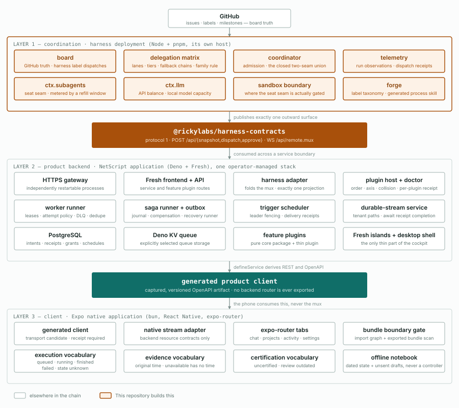

# The three layers

There is one chain from a label on an issue to a control on a phone, and it
passes through three deployments. Each deployment owns a different question, and
none of them may answer another's. This document describes all three at the same
depth, because the failures that cost the most are the ones that live in the
seams between them — and a seam is only visible when both sides are drawn.

Orange marks what **this repository** builds. Everything else in the drawing is
somebody else's deployment, described here only so that the interface can be
argued about honestly.

---

## Layer 1 — coordination  ·  **this repository**

A Node and pnpm workspace, deployed on its own host. It owns three questions:
what may run, who may certify it, and what actually ran.

**board.** GitHub is the store, not a cache of one. Issues, labels and
milestones are the record; columns, lanes and anomalies are projections computed
from that record and never written back as a second source. A label is the
protocol — applying one is an act, not an annotation.

**delegation matrix.** The single routing authority. It maps a lane to a tier, a
tier to a provider order, and a refusal to the next candidate. Dispatch names a
lane, never a model, so the matrix stays the only place a model id appears. Two
rules earn their keep: an author may not be its own evaluator, and a quota
trigger never falls back to a sibling model on the same subscription — that
would be a fallback in name only. The trigger union is closed at six members;
adding a seventh is a deliberate edit, not an incidental one.

**coordinator.** Admission. It decides whether a request may become a run, and
records the decision before anything is launched. `accepted: true` means
admitted, not started.

**telemetry.** Run observations, dispatch receipts, and the evidence that
attaches to both. A dispatch the provider refused is not a run, and the record
has to be able to say so without inventing a state.

**the two seams.** This is the layer's central distinction and the reason it
exists at all. `ctx.subagents` buys a **seat**, metered by a refill window;
`ctx.llm` buys **tokens**, metered by a balance. When a seat is exhausted you
*wait*; when a balance is exhausted you *pay*. Collapsing them into one
"capacity" concept makes both meters wrong. The union is closed at two members.

**sandbox boundary.** The seat seam cannot be gated inside a vendor CLI's child
process — there is no interception point there, and pretending otherwise
produces security theatre. So the gate moves outward to the sandbox boundary,
where the process actually starts. This is an admission about where control is
real, not a preference.

**forge.** Bootstraps a target repository's label taxonomy and emits the process
skill that reads it. Planning and ejection are safe; applying a taxonomy mutates
somebody's repository and stays an owner action.

---

## Layer 2 — the product backend

A NetScript application on Deno and Fresh: one operator-managed stack of
independently restartable processes. It is not a client of the backend. **It is
the backend.**

That distinction is the whole reason this document exists. NetScript ships
*definition* builders — `defineJobHandler`, saga step declarations, trigger
providers, stream resources. The definitions are real and the types are good,
but the execution semantics they imply are the consumer's to implement. A
handler registered with `defineJobHandler` runs; it does not thereby acquire
retry, timeout, lease or dead-letter behaviour. `SagaOutboxPort` is an interface
with no implementation, and a compensating step is terminal unless someone
writes the runner that resumes it. `dispatchAction` can complete successfully
without anything having been dispatched. Task retry metadata is accepted and
unread. The node and temporal cron providers throw.

None of that is a defect upstream. It is the boundary: core defines, the
application executes. Which means the work below is **owned engineering**, not
glue.

**HTTPS gateway.** One entry point in front of the whole stack. Every process
behind it restarts independently; none of them is a singleton whose death takes
the others with it.

**Fresh frontend + API.** Serves the application's own routes and the routes
contributed by feature plugins. The rendering half of this is the only thin part
of the whole system.

**harness adapter.** Consumes the contracts package's mux, folds the deltas, and
projects the result. **Exactly one reducer owns a run card.** If the phone also
folded the mux, two projections would disagree under partition and the
disagreement would surface as a user-visible flicker with no correct resolution.
The fold happens here, once.

**worker runner.** Dispatcher, payload validation, attempt policy with backoff,
lease acquisition and renewal under compare-and-swap, cancellation, dead-letter
routing, and an idempotency store. Every one of these is written here.

**saga runner + outbox.** A transactional outbox with claim, commit and recovery
paths; a durable step-and-compensation journal; and a recovery runner that can
resume a compensating saga after a crash. Without the runner, compensation is a
one-way door.

**trigger scheduler.** Persisted schedule state, leader fencing so two
schedulers cannot both fire, real dispatch into the typed enqueue path, and a
*required* delivery receipt — because a scheduler that cannot prove delivery is
a scheduler that silently stops.

**durable-stream service.** Installed and authenticated as a real service, with
tenant-qualified resource paths, and every write awaiting `receipt.completion`
rather than assuming it.

**PostgreSQL.** The authoritative record: principals, grants, command intents
and their receipts, the saga journal, the outbox, schedules, and plugin
configuration. Identity is `(tenantId, repositoryId, objectId)` throughout —
never a bare id that happens to be unique today.

**Deno KV queue.** The queue storage, selected explicitly rather than inherited
as a default, so that the choice can be argued with later.

**feature plugins.** A product feature is a **pure core package plus a thin
NetScript plugin**. The plugin contributes routes, background processors and
configuration; the core package holds the logic and knows nothing about hosting.
A directory under `plugins/` that does not define or contribute a plugin is not
a plugin — it is a package or an adapter, and should be renamed to say so. The
plugin registry and the AppHost bindings are **generated** from the manifests
and the authored settings; they are never hand-edited. The composition authority
is authored config plus plugin manifests; the runtime graph authority is the
authored settings file. Everything downstream of those two is derived.

**plugin host + doctor.** Order, axis and collision validation over the
registry, and a per-plugin **doctor receipt** showing the bindings that plugin
actually acquired — so an enabled-looking no-op default is a failure with
evidence, not a silence.

**Fresh islands + desktop shell.** The only genuinely thin part: a rendering
surface over the application above, plus a shell that hosts it.

**The outward surface.** `defineService` derives REST and OpenAPI from the
service definitions. That OpenAPI document is *captured* as a versioned
artifact, and a client package is generated from the capture. A backend router
type is never exported across the boundary; the artifact is.

---

## Layer 3 — the client

An Expo native application on bun and React Native, routed with expo-router.

**generated client.** Consumes the captured OpenAPI artifact over an
OpenAPILink bound to `expo/fetch`. It does not consume the coordination layer's
mux — that would be the second reducer this architecture exists to avoid.

**native stream adapter.** Speaks the same stream resource contracts as the
backend, on a transport appropriate to a phone.

**expo-router tabs.** Chat, projects, activity, settings.

**bundle boundary gate.** A build-time gate that walks the application import
graph *and* scans the exported bundle. It refuses Node built-ins, Prisma, Deno
globals, AppHost and worker or daemon runtimes, any `/server` leaf, and every
private package except the one contracts package. A phone bundle that can reach
a backend runtime is a leak, and the gate is what makes that statement testable
rather than aspirational.

**three vocabularies, kept apart.** *Execution* is queued, running, finished,
failed, and **state unknown**. *Evidence* is stale or unavailable, and always
dated. *Certification* is uncertified or outdated. Merging them produces the
specific bug this product exists to eliminate: an interface that reports missing
evidence as failure. **"State unknown" never triggers an automatic redispatch.**

**offline notebook.** Offline is a dated notebook of fetched state and unsent
drafts. It is never a controller, and it never invents a state transition it did
not observe.

---

## The two carriers

Between the layers sit two published surfaces. They are the only sanctioned way
across, and their rules are deliberate.

**Coordination → backend: the contracts package (protocol 1).**
The command half is all-POST, *including the read* — a GET is retried by
proxies, browsers and phones on a hunch, and a retried read that the caller
believes was singular is how phantom state appears. Idempotency keys are
required, not optional: an optional safety property is one that is absent
exactly when someone was in a hurry. The read half is a WebSocket mux carrying
**whole-value deltas, never patches**, with a `generation` per connection and a
`seq` that increments by one within a generation, so a gap is detectable rather
than plausible. Connecting is subscribing. An unknown kind is a third outcome,
not an error and not a silent drop. The envelope is validated; the payload
deliberately is not, so an unknown payload shape survives the hop.

**Backend → client: the generated client package.**
A captured, versioned OpenAPI artifact and the client generated from it. The
capture is the contract; the running server is not. This is what lets the phone
be built against a version rather than against a host.

---

## What this repository builds

Everything in orange: the whole of layer 1, and the contracts package that
leaves it. Concretely:

1. The board projections, and the discipline that keeps them projections.
2. The delegation matrix as the sole routing authority, with a closed trigger
   union and the two rules that make fallback meaningful.
3. Admission, and the record that a decision was made before anything launched.
4. The two seams, kept apart, and the sandbox boundary that makes the seat seam
   enforceable where it is actually enforceable.
5. Telemetry that can say a dispatch was refused without inventing a run.
6. **The published contracts package** — protocol 1, versioned, tagged.

## What this repository must not build

**A product feature.** Layer 1 answers what may run and what did run. It does
not render, schedule product work, or hold product state.

**A second outward surface.** One published package, one protocol version. A
consumer that needs a private package is a consumer that has been handed the
wrong boundary.

**A model id outside the matrix.** Dispatch names a lane. The moment a model id
appears at a call site, the matrix stops being the routing authority.

---

## Gaps, stated plainly

**The contracts package is not published.** Both downstream layers are written
against a specification rather than an installed artifact. This is the single
highest-leverage unblock in the chain: nothing below layer 1 can be integration-
tested against a version until the tag exists.

**One fidelity gap in the read half.** Provider liveness is modelled in five
states; the mux exposes four freshness states. A consumer currently maps the
difference, which means a distinction this layer considers meaningful is not
observable two layers down. Either the projection is lossless, or the loss is
documented as intentional. Right now it is neither, and the choice belongs to
this repository because this repository owns the protocol.

---

## A note on naming

This document describes two downstream deployments without naming them. That is
deliberate while the question of which consumer names may appear in public
documentation remains an open owner decision. The roles — *the product backend*,
*the client* — are the load-bearing part; the repository names are not, and
adding them later costs nothing.